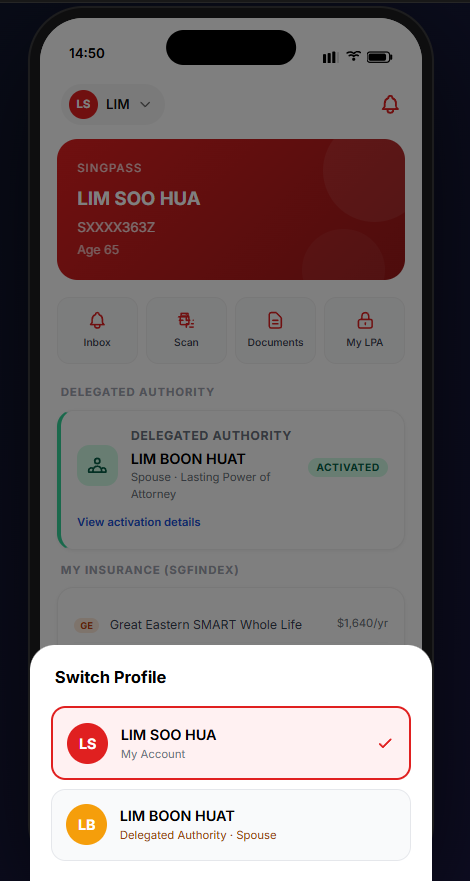
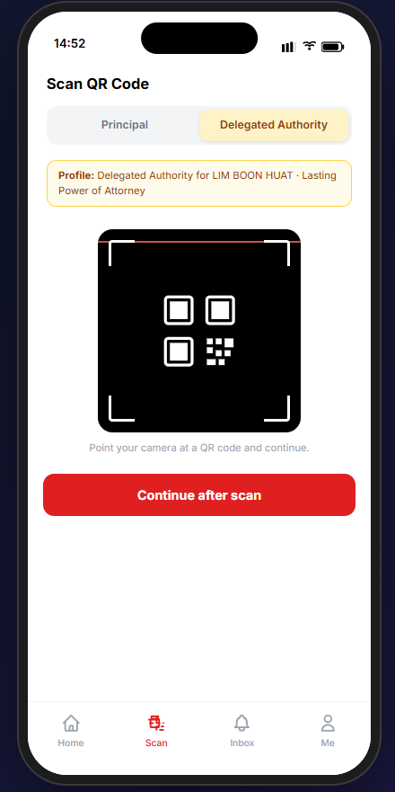
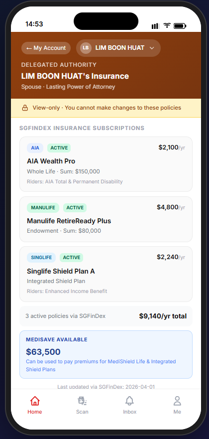
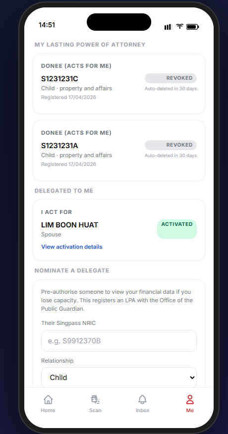
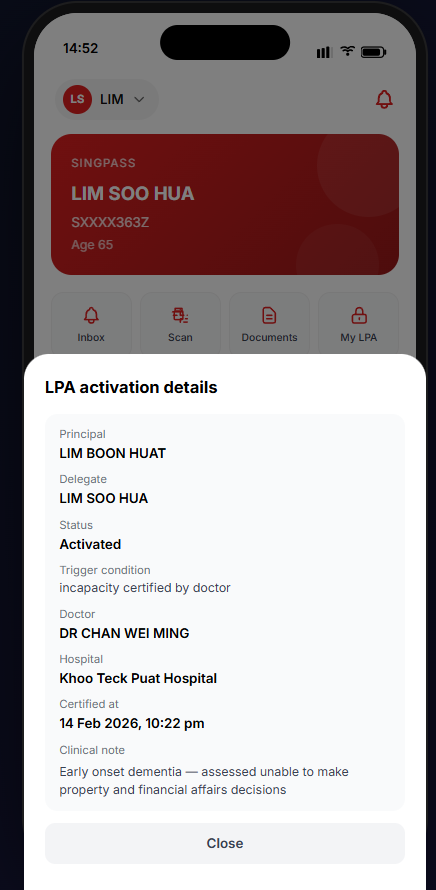
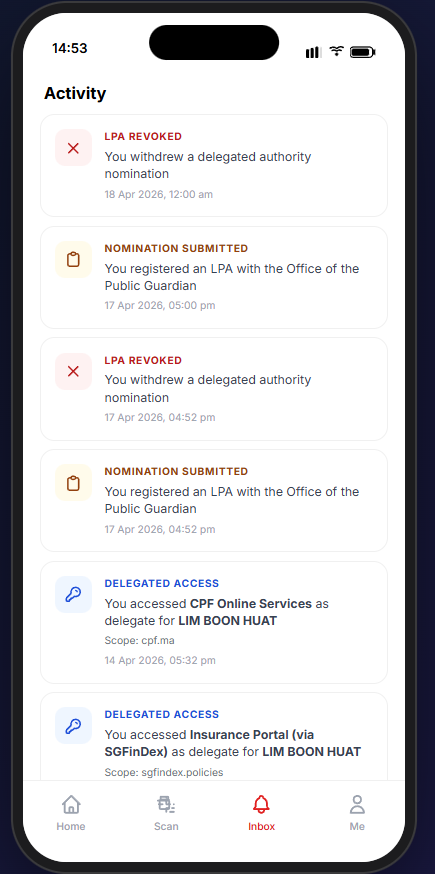

# CareAuth SG – Delegated Financial Authority (PoC)

A proof-of-concept demonstrating **delegated financial authority** via Singpass, built for Singapore's context. Inspired by the UK's delegated authority framework.

---

## The problem

When a person suddenly or progressively loses capacity (stroke, dementia, severe injury), families or legally appointed representatives need to coordinate care — fast. The most stressful part is understanding the **financial picture**: Can they afford a nursing home? Do they have enough CPF? Are hospital bills covered?

Today, every financial journey in Singapore assumes the **account holder** performs a live biometric Singpass login. If they can't, family members are left in the dark.

## The concept

A named delegate (family member, legal rep) pre-authorised by the principal can:
1. Open their Singpass app and **switch profile** between `Principal` and `Delegated Authority`
2. On the Scan tab, choose `Principal` or `Delegated Authority` before scanning a service-provider QR code
3. Access a **view-only scoped dataset** when acting as delegated authority (e.g. CPF MediSave only, insurer plans/sum insured/premiums)
4. Trigger full delegated mode only when OPG/LPA guardrails are satisfied (registered + activated)
5. Leave an audit trail visible to both delegate and principal in inbox/activity

For insurance, the PoC uses SGFinDex-style aggregation as the starting point (coverage discovery across the 7 major participating insurers), then reveals only delegated-safe fields.

---

## Tech stack

- **MockPass** (`@opengovsg/mockpass`) — mock Singpass OIDC provider
- **Node.js / Express** — backend, OIDC callback, API
- **Vanilla HTML + Tailwind CSS** — frontend

---

## Quick start

```bash
# 1. Clone and enter the project
git clone <repo-url>
cd delegated-authority-sg

# 2. Install dependencies
npm install

# 3. Set up env
cp .env.example .env

# 4. Start both MockPass and the app
npm start
# or: ./start.sh
```

Open **http://localhost:3000**

---

## Demo guide

MockPass shows a dropdown of test NRICs. Use these for the three demo scenarios:

### Scenario 1 — Stroke (Parent / Adult Child)

| Role | NRIC | Name |
|------|------|------|
| Principal | `S9812379B` | TAN AH KOW (74, stroke) |
| Delegate | `S9912370B` | TAN MEI LING (45, daughter) |

1. Login as `S9912370B` (delegate app holder)
2. In Singpass app Home/Scan, switch from `Principal` to `Delegated Authority` for `S9812379B`
3. Scan CPF/insurance QR to access restricted view-only scopes

### Scenario 2 — Dementia (Spouse)

| Role | NRIC | Name |
|------|------|------|
| Principal | `S9812353I` | LIM BOON HUAT (68, dementia) |
| Delegate | `S9912363Z` | LIM SOO HUA (65, spouse, LPA) |

1. Login as `S9912363Z` (delegate app holder with active LPA)
2. Switch profile to `Delegated Authority` for `S9812353I`
3. Scan insurer QR and view active plans/sum insured/premiums from SGFinDex dataset

### Scenario 3 — Grant delegation live

1. Login as any principal NRIC
2. In `Me`, nominate a delegate (writes LPA registration to OPG registry)
3. Use `/hospital` to issue incapacity certificate and activate the registered LPA
4. Login as nominated person and switch to delegated profile in app/scan

---

## Key design decisions

**Why limited data only?**
Delegates see CPF balance *ranges* (not exact figures), masked NRICs, and no account numbers or addresses. The goal is "enough to plan care" — not full financial access.

**Why profile switching inside Singpass?**
The user operates from their own Singpass app session but explicitly selects profile context (`Principal` or `Delegated Authority`) before data access. This makes delegated intent visible and prevents silent privilege escalation.

**Why OPG + hospital guardrails?**
Delegated access is discoverable from OPG LPA records, and only activated after doctor-certified incapacity from hospital integration. This aligns with legal trigger conditions instead of ad-hoc sharing.

**Why audit for both parties?**
Every delegated QR login event writes to audit log with actor, principal, service provider, and scopes accessed, then notifies both principal and delegate views.

**SINGPASS_CLIENT_PROFILE=direct**
This env variable tells MockPass to return a plain signed JWT instead of JWE-encrypted tokens. Essential for this demo — without it you'd need to host a JWKS endpoint and decrypt with your private key.

**Sub claim format**
MockPass returns NRIC inside the JWT `sub` claim as `s=S1234567A,u=<uuid>`. The server parses this with `/s=([^,]+)/i`.

---

## Project structure

```
delegated-authority-sg/
├── server.js                 # Express + OIDC + API routes
├── data/
│   ├── personas.json         # Financial mock data (keyed by NRIC)
│   ├── delegations.json      # Delegation state (pending/active/revoked)
│   ├── opg-registry.json     # LPA registrations + activation status
│   ├── service-providers.json# SP scopes for principal vs delegated profiles
│   └── audit-log.json        # Shared activity trail for principal + delegate
└── public/
    ├── index.html            # Landing page
    ├── app/index.html        # Singpass-style app with profile switching + scan
    ├── sp/cpf.html           # CPF service provider (scoped delegated view)
    └── hospital/index.html   # Doctor certification trigger (LPA activation)
```

---

## What this is not

- Not production code — session store is in-memory, data is in JSON files
- Not connected to real CPF/MyInfo APIs — all data is mocked
- Not a complete LPA system — delegation management is simplified for demo purposes

---

## Potential next steps (for real implementation)

- Integrate with real MyInfo v3 API (requires Singpass developer onboarding)
- LPA verification via Office of the Public Guardian API
- Sync delegated nominee updates bi-directionally with OPG systems of record
- Granular permission scopes (e.g. grant CPF-only vs. full snapshot)
- Time-limited delegations (auto-expire after N months)
- Audit log of every delegated access (who viewed what, when)
- Extend to banking: delegate-view of bank balances via SGFinDex / FI connectors

## Screenshots

### Singpass app profile switch



### Scan with delegated authority



### CPF / insurance scoped delegated view



### Delegate nomination (Me tab)



### Hospital certification activation



### Audit trail (delegated authority view)



### Audit trail (principal view)


